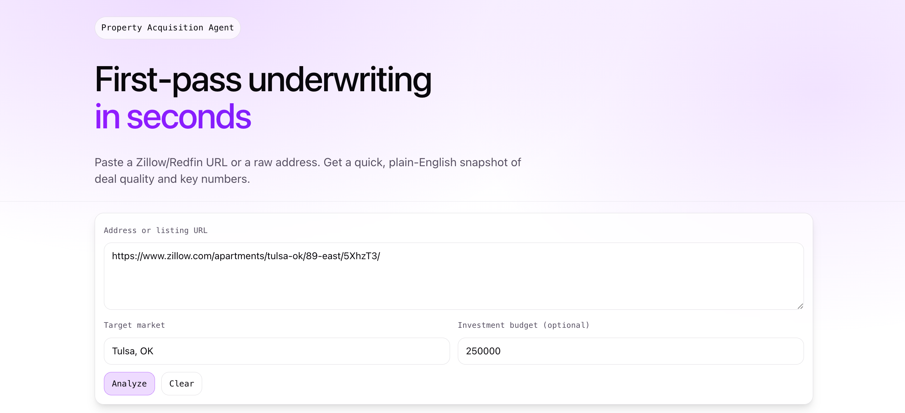
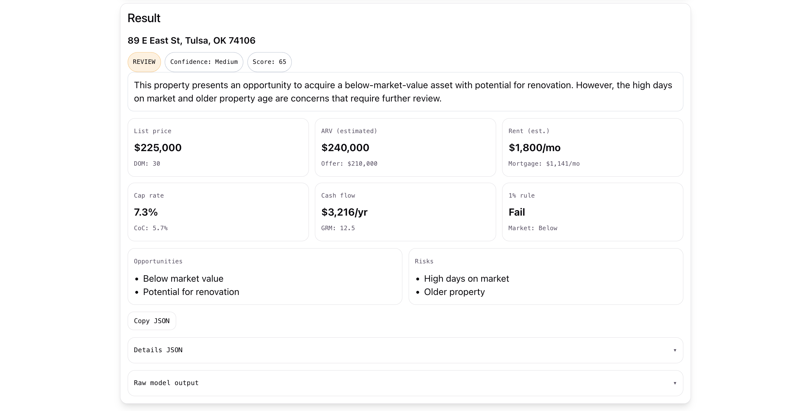

# Property Acquisition Agent

A simple **property underwriting / acquisition analysis** app.

- **Backend**: FastAPI + Groq (Llama 70B)
- **Frontend**: React (Vite + TypeScript)

## Live Demo

- Frontend (Vercel): **TODO** `https://YOUR_VERCEL_URL.vercel.app`
- Backend (Render/Railway/Fly/etc.): **TODO** `https://YOUR_BACKEND_URL`

> The frontend expects the backend URL via `VITE_API_BASE`.

## Screenshots

Add screenshots to `docs/screenshots/` and update the links below.

- Home / Input

  

- Result / KPIs

  

## Features

- Paste a Zillow/Redfin URL or address
- Auto-infers market from URL (e.g. `tulsa-ok` → `Tulsa, OK`) when market is left at default
- Returns:
  - A plain-English verdict (PASS / REVIEW / FAST-TRACK)
  - Human-friendly KPIs (cap rate, cash-on-cash, rent estimate, etc.)
  - Expandable JSON details

## Project Structure

- `main.py`
  - FastAPI backend
  - `POST /analyze`
  - `GET /health`
- `frontend/`
  - React + Vite frontend

## Local Development

### 1) Backend (FastAPI)

Create a `.env` file in the repo root (do **not** commit it):

```bash
cp .env.example .env
```

Edit `.env` and set:

- `GROQ_API_KEY=...`
- `GROQ_MODEL=llama-3.3-70b-versatile` (default)

Install Python deps:

```bash
python3 -m pip install -r requirements.txt
```

Run the API:

```bash
uvicorn main:app --reload --port 8000
```

Test:

- `http://127.0.0.1:8000/health`

### 2) Frontend (React)

Install deps:

```bash
cd frontend
npm install
```

Run dev server:

```bash
npm run dev
```

By default, Vite proxies API calls to `http://127.0.0.1:8000`.

If you want to call a remote backend, set `VITE_API_BASE`.

## Deployment

### Frontend on Vercel

1. Push repo to GitHub
2. Vercel → **New Project** → select the repo
3. Configure:

- **Root Directory**: `frontend`
- **Framework Preset**: `Vite`
- **Build Command**: `npm run build`
- **Output Directory**: `dist`

4. Add Vercel environment variable:

- `VITE_API_BASE=https://YOUR_BACKEND_URL`

5. Deploy

### Backend hosting (recommended)

Vercel is not ideal for long-running FastAPI services. Use one of:

- Render
- Railway
- Fly.io
- A VPS

When deployed, ensure:

- The backend has `GROQ_API_KEY`
- CORS allows your Vercel domain (currently it’s permissive)

## Notes

- Do not commit secrets (`.env` is in `.gitignore`).
- The model may wrap JSON in code fences; backend strips and parses robustly.
